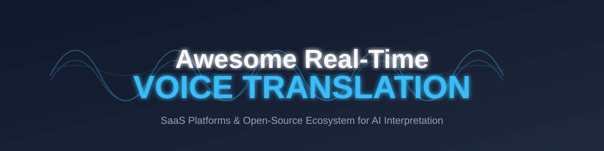

  

<h1 align="center">Awesome Real-Time Voice Translation 🎤🌍</h1>

  
  
  
  
  

  <b>A curated list of AI-powered real-time speech-to-speech, transcription, and voice translation solutions.</b> 
  <i>Optimized for low-latency, high-accuracy multilingual communication.</i>

  

## 📖 Introduction

This repository tracks notable **SaaS platforms** and **open-source projects** building **real-time voice translation** solutions. These tools enable live interpretation during conversations, meetings, conferences, and events by performing speech recognition (ASR), neural machine translation (NMT), and speech synthesis (TTS) with ultra-low latency.

> [!TIP]
> **SEO Focus**: Looking for "AI Voice Interpretation," "Streaming Translation APIs," or "Self-hosted Speech-to-Speech"? You've found the right place.

---

## 📑 Table of Contents
- [🚀 SaaS Products](#-saas-products)
  - [Core Platforms](#core-platforms)
  - [Advanced APIs](#advanced--specialized-platforms)
- [🛠️ Open-Source GitHub Projects](#️-open-source-github-projects)
- [🤝 How to Contribute](#-how-to-contribute)
- [⚖️ Disclaimer](#️-disclaimer)

---

## 🚀 SaaS Products

### Core Platforms (Real-Time AI Interpretation)

| SaaS Product | Description | Company Size (Est. Val/Rev) | Pricing | Free Tier / Trial Limits |
| :--- | :--- | :--- | :--- | :--- |
| **[DeepL Voice](https://www.deepl.com/)** | 🎙️ High-accuracy voice translation using the DeepL engine. | **$2B - $5B** (Valuation) | **Custom:** Contact sales for Voice API pricing. | **Free Tier:** 50k chars/mo for Translator (not Voice). |
| **[KUDO AI](https://www.kudo.ai/)** | 💼 AI simultaneous interpretation for business communication. | **$33.7M+** (Est. Revenue) | **Subscription:** Tiered packages (75h to 1,000h per year). | **Free Tier:** 10 minutes of live transcription for testing. |
| **[Interprefy](https://interprefy.com/)** | 🌍 Professional remote interpretation for high-stakes multilingual events. | **$28.1M+** (Est. Revenue) | **Custom:** Based on duration and complexity. | **Free Tier:** Demos available on request. |
| **[Wordly.ai](https://wordly.ai/)** | 📡 Enterprise-grade interpretation for conferences and large events. | **$16.8M** (Est. Valuation) | **Starter:** ~$75/hour Custom quotes for large packages. | **Free Trial:** Available upon request. |
| **[Maestra AI](https://maestra.ai/)** | 🎥 Comprehensive platform for real-time speech-to-speech, transcription, and subtitles. | **$9.6M** (Est. Valuation) | **Pay-As-You-Go:** $0.20/min **Lite:** $23/mo (180 mins) **Premium:** $79/mo (900 mins) | **Free Trial:** 30 minutes of free transcription/translation. |
| **[Palabra.ai](https://palabra.ai/)** | 💬 AI-powered real-time voice translation optimized for conversations, meetings, and events. | **$8.4M** (Raised) | **Starter:** $60/mo for 3h **Pro:** $200/mo for 10h **Team:** $1000/mo for 50h | **Free Trial:** Limited daily minutes to test latency/cloning. |
| **[Timekettle X1](https://www.timekettle.co/)** | 🎧 Hardware + AI hybrid for two-way translation (earbuds/device). | **$5.9M+** (Est. Revenue) | **Hardware:** $699.99 (Standalone device) | **N/A:** Hardware purchase; no recurring sub for core features. |
| **[Talo](https://talo.ai/)** | ⚡ Low-latency solution focused on natural conversation flow. | **Acquired** (by Palabra) | **Starter:** $33/mo (95 mins) **Pro:** $80/mo (400 mins) **Team:** $400/mo | **Free Trial:** 7-day trial with 200 minutes. |

### Advanced & Specialized Platforms (APIs)

| Service | Description | Company Size (Est. Val/Rev) | Pricing (per 1M characters) | Free Tier Limits |
| :--- | :--- | :--- | :--- | :--- |
| **[Microsoft Translator](https://azure.microsoft.com/en-us/products/ai-services/ai-translator)** | ☁️ Azure-based translation with broad language support. | **$3T+** (Market Cap) | $10.00 | 2,000,000 characters per month |
| **[Google Translate Live](https://cloud.google.com/translate)** | 🔍 Standard NMT for apps and streaming. | **$2T+** (Market Cap) | $20.00 | 500,000 characters per month |
| **[iTranslate](https://www.itranslate.com/)** | 📱 Consumer app and enterprise-level translation. | **$15M+** (Est. Revenue) | **Consumer:** $5.99/mo (Pro) **API:** Custom Enterprise | Limited free version for app users. |

---

## 🛠️ Open-Source GitHub Projects

> [!NOTE]
> Sorted by GitHub Star Count (Popularity)

- **[Coqui TTS / Tortoise TTS](https://github.com/coqui-ai/TTS)**   
  🔊 High-quality open-source text-to-speech models for natural voice output in target languages.

- **[OpenVoice](https://github.com/myshell-ai/OpenVoice)**   
  👥 Instant voice cloning and real-time voice conversion toolkit for natural prosody.

- **[Meta MMS (Massively Multilingual Speech)](https://github.com/facebookresearch/fairseq/tree/main/examples/mms)**   
  🌐 Large collection of speech models for 1,000+ languages.

- **[faster-whisper + NLLB / Seamless pipelines](https://github.com/SYSTRAN/faster-whisper)**   
  🚀 High-performance Whisper implementation optimized for real-time translation pipelines.

- **[NVIDIA NeMo](https://github.com/NVIDIA/NeMo)**   
  🏗️ Toolkit for building ASR, TTS, and translation models with GPU acceleration.

- **[Vosk API](https://github.com/alphacep/vosk-api)**   
  🔌 Lightweight offline speech recognition supporting 20+ languages.

- **[Seamless Communication (Meta)](https://github.com/facebookresearch/seamless_communication)**   
  🔗 State-of-the-art SeamlessM4T model family for speech-to-speech translation.

- **[SpeechBrain](https://github.com/speechbrain/speechbrain)**   
  🧠 PyTorch-based toolkit for holistic speech processing.

- **[Piper TTS](https://github.com/rhasspy/piper)**   
  ⚡ Fast, local neural text-to-speech optimized for edge devices.

- **[whisper-live](https://github.com/collabora/WhisperLive)**   
  📡 Real-time whisper-based transcription for low-latency streaming.

- **[Live-Translate](https://github.com/ahmetoner/whisper-asr-websocket)**   
  💻 WebSocket-based speech recognition server for live translation.

- **[Rhasspy / Mycroft](https://github.com/rhasspy/rhasspy)**   
  🏠 Offline private voice assistant frameworks.

---

## 🏗️ Frameworks for Custom Agents

Use **Faster-Whisper + SeamlessM4T + Piper TTS** with **LangGraph** or **Streaming pipelines** (WebSockets, WebRTC) for low-latency, self-hosted systems.

- **VAD**: [Silero VAD](https://github.com/snakers4/silero-vad)
- **Noise Suppression**: [DeepFilterNet](https://github.com/Rikorose/DeepFilterNet)

---

## 🤝 How to Contribute

1. **Fork** the repo.
2. **Add/edit** entries in `README.md`.
3. Follow the format: `[Name](Link) | Badge | Description`.
4. Submit a **PR** with details.

---

## ⚖️ Disclaimer

- Real-time translation accuracy varies. Verify critical communications.
- GPU recommended for best performance on self-hosted solutions.

---

## 📈 Star History

  

---

  <b>Made for global teams, event organizers, and developers.</b> 
  <i>Let's make real-time voice translation accessible to everyone.</i>

